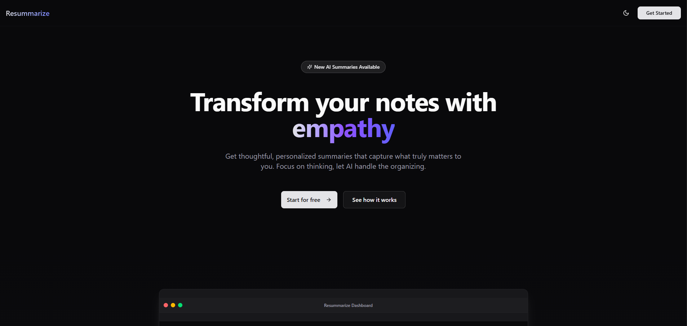
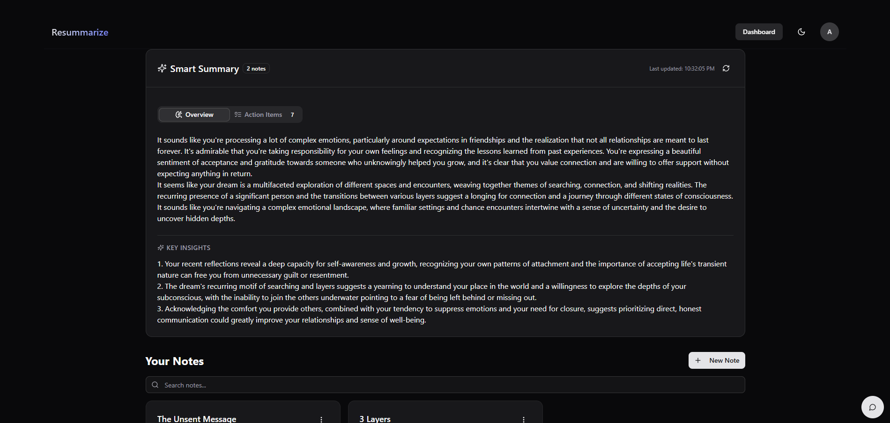

# Resummarize

> AI-powered note-taking application with intelligent summarization and conversational features

## 🚀 Live Demo

Visit [re-summarize.vercel.app](https://re-summarize.vercel.app) to see the application in action.



## 📝 Project Overview

Resummarize is a modern note-taking application that leverages artificial intelligence to help users organize their thoughts and gain new insights. Beyond basic note management, Resummarize offers AI-powered summarization of content and a conversational assistant that can discuss notes or provide therapist-like guidance based on the user's entries.



## ✨ Key Features

- **Secure Authentication**
  - Google OAuth integration
  - Email & password authentication

- **Comprehensive Note Management**
  - Create, edit, and delete notes

- **AI-Powered Capabilities**
  - Smart note summarization in various formats:
    - Brief summaries
    - Detailed analyses
    - Actionable plans
    - To-do list generation
    - Key points extraction
  - Conversational AI assistant with two modes:
    - Notes discussion assistant
    - Therapeutic conversation partner

## 🛠️ Technology Stack

- **Frontend**:
  - [Next.js](https://nextjs.org/) - React framework for production
  - [TypeScript](https://www.typescriptlang.org/) - Type-safe JavaScript
  - [Tailwind CSS](https://tailwindcss.com/) - Utility-first CSS framework
  - [shadcn/ui](https://ui.shadcn.com/) - Reusable component library

- **Backend & Services**:
  - [Supabase](https://supabase.com/) - Authentication and database
  - [Google Cloud](https://cloud.google.com/) - OAuth provider
  - [Gemini AI](https://ai.google.dev/) - AI summarization and conversation

- **Development Tools**:
  - [React Query](https://react-query.tanstack.com/) - Server state management

## 🚦 Getting Started

### Prerequisites

- Node.js (v20 or later)
- npm or yarn
- Supabase account
- Google Cloud account (for OAuth)
- Gemini API key

### Installation

1. Clone the repository:
   ```bash
   git clone https://github.com/abhisheksharm-3/resummarize.git
   cd resummarize
   ```

2. Install dependencies:
   ```bash
   npm install
   # or
   yarn install
   ```

3. Set up environment variables by creating a `.env.local` file in the project root with the following:
   ```
   NEXT_PUBLIC_SUPABASE_URL=your_supabase_url
   NEXT_PUBLIC_SUPABASE_ANON_KEY=your_supabase_anon_key
   NEXT_PUBLIC_GEMINI_API_KEY=your_gemini_api_key
   ```

4. Start the development server:
   ```bash
   npm run dev
   # or
   yarn dev
   ```

5. Open [http://localhost:3000](http://localhost:3000) with your browser to see the result.

## 🔐 Authentication Setup

### Supabase Configuration

1. Create a new project in [Supabase](https://supabase.com/)
2. Navigate to the project dashboard and find your project URL and anon key
3. Add these values to your environment variables

### Google OAuth Setup

1. Create a new project in [Google Cloud Console](https://console.cloud.google.com/)
2. Set up an OAuth consent screen with the following scopes:
   - `email`
   - `profile`
   - `openid`
3. Create OAuth client credentials
4. Add the Supabase-provided redirect URI to the authorized redirect URIs field
5. Add your site URL to the authorized JavaScript origins
6. Copy the generated client ID and client secret
7. In your Supabase authentication settings, enable Google Auth and paste the client ID and secret

## 📁 Project Structure

```
resummarize/
├── src/
│   ├── app/                      # Next.js app router structure (routes, layouts, global styles)
│   │   ├── api/                  # Route handlers for server actions
│   │   │   └── auth/             # Auth-related API routes (OAuth callbacks etc.)
│   │   ├── auth/                 # Pages for login, signup, password reset, etc.
│   │   ├── dashboard/            # Main note-taking dashboard UI
│
│   ├── components/               # Reusable React components
│   │   ├── auth/                 # UI components for auth flows (forms, buttons)
│   │   ├── chatbot/              # Chatbot UI components (e.g., floating assistant)
│   │   ├── dashboard/            # Dashboard layout and note display components
│   │   ├── layout/               # Site-wide layout components like Navbar
│   │   ├── notes/                # Note-specific UI (create, edit, delete dialogs, cards)
│   │   ├── shared/               # Common UI patterns (e.g., empty state)
│   │   └── ui/                   # Base UI components from `shadcn/ui` or custom elements
│
│   ├── controllers/              # Logic and handlers for auth and note operations
│
│   ├── hooks/                    # Custom React hooks for app state, auth, notes, etc.
│
│   ├── lib/                      # Constants, utilities, and provider setup
│   │   ├── constants/            # Prompt templates and static data
│   │   └── react-query/          # React Query client/provider config
│
│   ├── services/                 # External integrations and service logic
│   │   ├── ai/                   # AI-related services: summarization, chatbot, Gemini client
│   │   └── supabase/            # Supabase client, middleware, server helpers
│
│   └── types/                    # Shared TypeScript types and interfaces

```

## 📄 License

MIT © [Abhishek Sharma](https://github.com/abhisheksharm-3)